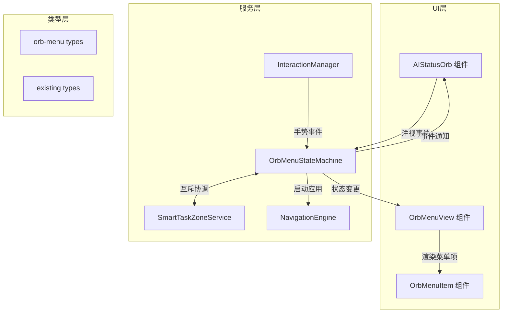
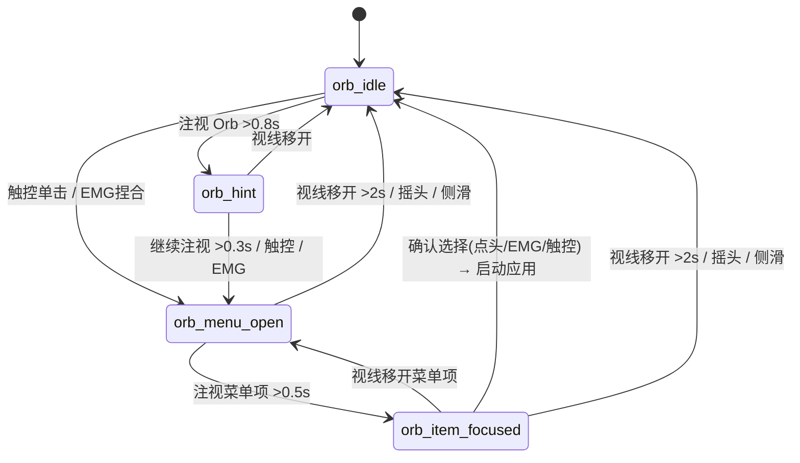
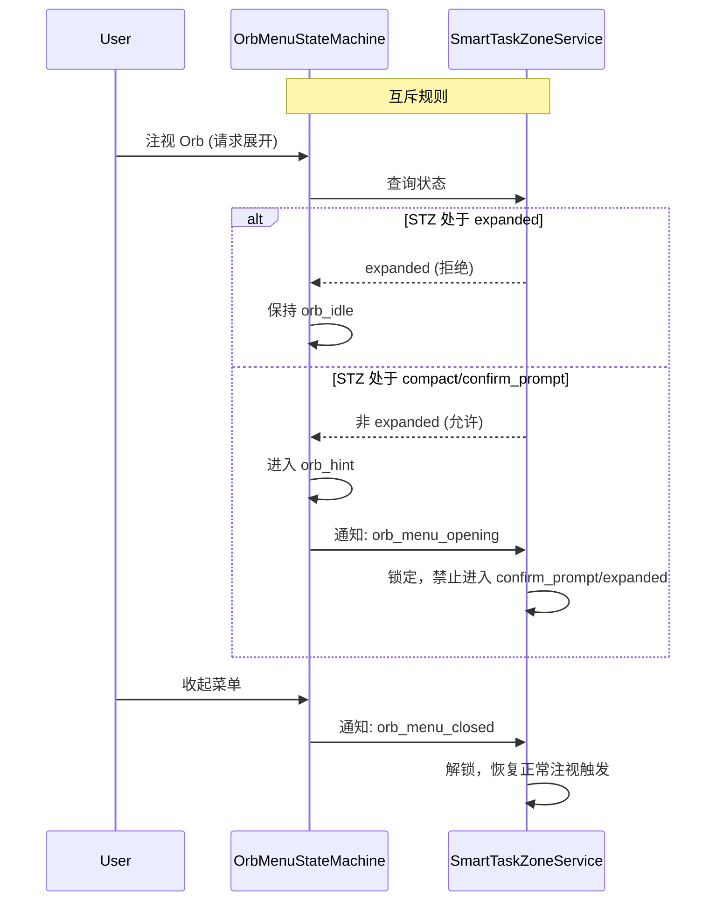

# Orb Menu Hub — 技术设计文档

## 概述

Orb Menu Hub 将 Q95 Pro 智能眼镜的应用导航从底部导航栏（Bottom_Nav_Bar）迁移至 AI_Status_Orb 内的环形菜单（Orb_Menu）。用户通过注视 AI_Status_Orb 触发菜单展开，选择菜单项启动应用，实现"注视即展开"的自然交互模式。

核心设计目标：
- 移除底部导航栏，释放屏幕空间
- 新增 Orb_Menu 状态机，与现有 Smart_Task_Zone 状态机协调互斥
- 环形菜单布局，支持 11 个应用入口
- 多模态交互（注视、触控、EMG、点头）触发展开/选择/收起
- 科幻风格动画，60fps 流畅度

### 设计决策

| 决策 | 选择 | 理由 |
|------|------|------|
| 状态机架构 | 独立 OrbMenuStateMachine + 双向互斥锁 | 与 SmartTaskZone 解耦，通过事件通知协调 |
| 菜单布局算法 | 极坐标计算，90°-270° 弧度范围 | AI_Status_Orb 位于左上角，菜单向右下展开避免超出屏幕 |
| 动画方案 | CSS Transitions + requestAnimationFrame | 利用 GPU 加速，保证 60fps |
| 菜单项数据 | 复用 NavigationEngine 的 AVAILABLE_ROUTES | 保持路由一致性，避免重复定义 |

## 架构

### 系统架构图



### 状态机交互图



### Smart_Task_Zone 互斥协调




## 组件与接口

### 1. OrbMenuStateMachine（核心服务）

新增文件：`src/services/OrbMenuStateMachine.ts`

```typescript
// 状态定义
type OrbMenuState = 'orb_idle' | 'orb_hint' | 'orb_menu_open' | 'orb_item_focused';

// 事件类型
type OrbMenuEvent =
  | { type: 'GAZE_ORB_START' }
  | { type: 'GAZE_ORB_END' }
  | { type: 'GAZE_HINT_CONFIRM' }
  | { type: 'QUICK_OPEN'; source: 'side_touchpad' | 'emg_pinch' }
  | { type: 'GAZE_ITEM'; itemId: string }
  | { type: 'GAZE_ITEM_END' }
  | { type: 'CONFIRM_SELECT'; source: 'nod' | 'emg_pinch' | 'side_touchpad' }
  | { type: 'DISMISS'; source: 'gaze_away' | 'head_shake' | 'side_swipe' }
  | { type: 'APP_LAUNCH_FAILED'; appId: string; error: string };

// 回调接口
interface OrbMenuCallbacks {
  onStateChange?: (from: OrbMenuState, to: OrbMenuState) => void;
  onHintStart?: () => void;
  onMenuOpen?: () => void;
  onMenuClose?: (reason: string) => void;
  onItemFocused?: (itemId: string) => void;
  onItemUnfocused?: () => void;
  onAppLaunch?: (appId: string) => void;
  onAppLaunchError?: (appId: string, error: string) => void;
}

// 核心类
class OrbMenuStateMachine {
  constructor(
    callbacks: OrbMenuCallbacks,
    smartTaskZone: SmartTaskZoneService,
    navigationEngine: NavigationEngine
  );

  getState(): OrbMenuState;
  getFocusedItem(): string | null;
  send(event: OrbMenuEvent): void;
  isMenuBlocked(): boolean;
  dispose(): void;
}
```

关键行为：
- `send()` 处理所有状态转换事件
- 内部维护注视计时器（0.8s hint、0.3s confirm、0.5s item focus、2s gaze away）
- 通过 `smartTaskZone.getState()` 检查互斥条件
- 状态变更时通过 callbacks 通知 UI 层
- 状态变更时发出事件通知 SmartTaskZone 锁定/解锁

### 2. OrbMenuView（菜单容器组件）

新增文件：`src/components/smart-task/OrbMenuView.tsx`

```typescript
interface OrbMenuViewProps {
  menuState: OrbMenuState;
  menuItems: OrbMenuItem[];
  focusedItemId: string | null;
  activeAppId: string | null;
  orbPosition: { x: number; y: number };
  onGazeItem?: (itemId: string) => void;
  onGazeItemEnd?: () => void;
  onConfirmSelect?: (source: 'nod' | 'emg_pinch' | 'side_touchpad') => void;
}

function OrbMenuView(props: OrbMenuViewProps): JSX.Element;
```

职责：
- 根据 `menuState` 控制展开/收起动画
- 使用极坐标算法计算菜单项位置
- 渲染半透明毛玻璃背景
- 管理菜单项的聚焦/高亮状态

### 3. OrbMenuItem（菜单项组件）

新增文件：`src/components/smart-task/OrbMenuItem.tsx`

```typescript
interface OrbMenuItemProps {
  item: OrbMenuItemData;
  position: { x: number; y: number };
  isFocused: boolean;
  isActive: boolean;
  animationDelay: number;
  menuState: OrbMenuState;
}

function OrbMenuItem(props: OrbMenuItemProps): JSX.Element;
```

### 4. AIStatusOrb 扩展

修改文件：`src/components/smart-task/AIStatusOrb.tsx`

新增 props：
```typescript
interface AIStatusOrbProps {
  status: AIStatus;
  size?: number;
  // 新增
  orbMenuState?: OrbMenuState;
  activeAppId?: string | null;
  onGazeStart?: () => void;
  onGazeEnd?: () => void;
}
```

新增行为：
- `orb_hint` 状态时显示光晕扩散动效
- `orb_menu_open` 状态时显示光环扩散效果（颜色与 AI 状态一致）
- `orb_idle` 状态时在外圈显示当前活跃应用的弧形指示器

### 5. SmartTaskZoneService 扩展

修改文件：`src/services/SmartTaskZone.ts`

新增接口：
```typescript
// 新增方法
class SmartTaskZoneService {
  // 现有方法...

  // 新增：Orb Menu 互斥锁
  setOrbMenuLock(locked: boolean): void;
  isOrbMenuLocked(): boolean;
}
```

当 `orbMenuLocked = true` 时，`onGazeEvent` 中的 compact → confirm_prompt 转换被阻止。

### 6. 布局算法模块

新增文件：`src/utils/radialLayout.ts`

```typescript
interface RadialLayoutConfig {
  centerX: number;
  centerY: number;
  radius: number;
  startAngle: number;  // 默认 90°
  endAngle: number;    // 默认 270°
  itemCount: number;
  viewportWidth: number;
  viewportHeight: number;
}

interface RadialPosition {
  x: number;
  y: number;
  angle: number;
}

function calculateRadialPositions(config: RadialLayoutConfig): RadialPosition[];
function clampToViewport(positions: RadialPosition[], itemSize: number, viewport: { width: number; height: number }): RadialPosition[];
```
