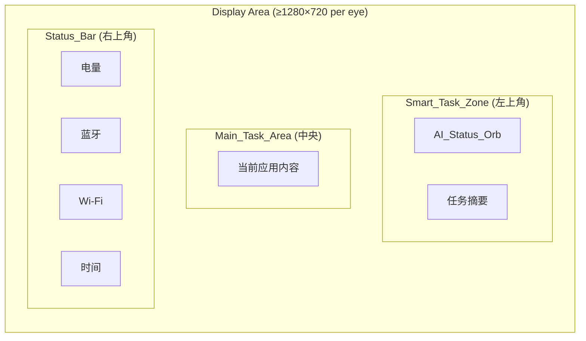
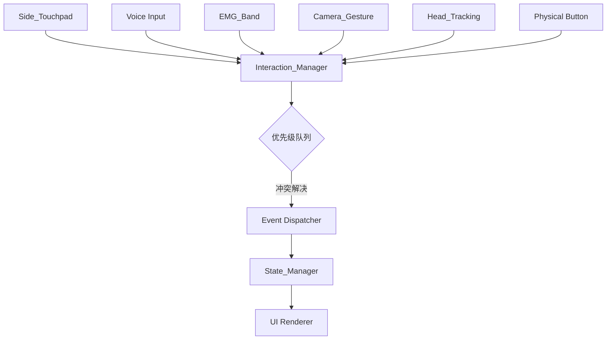
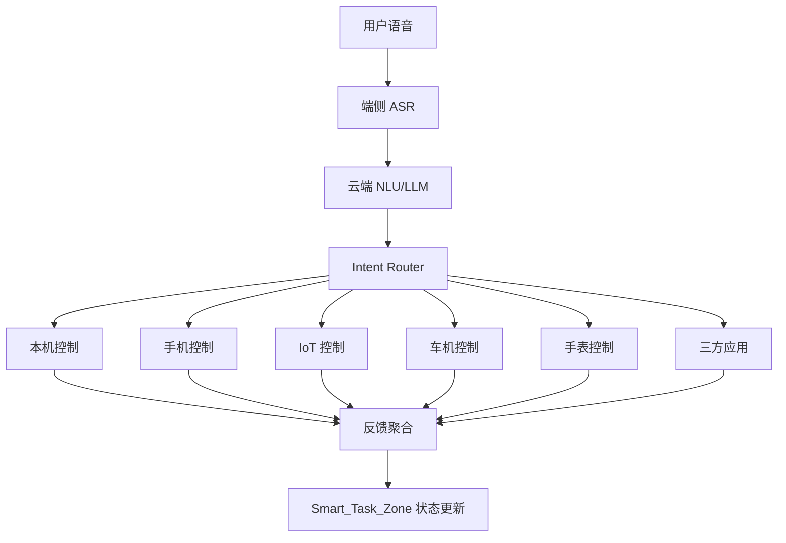
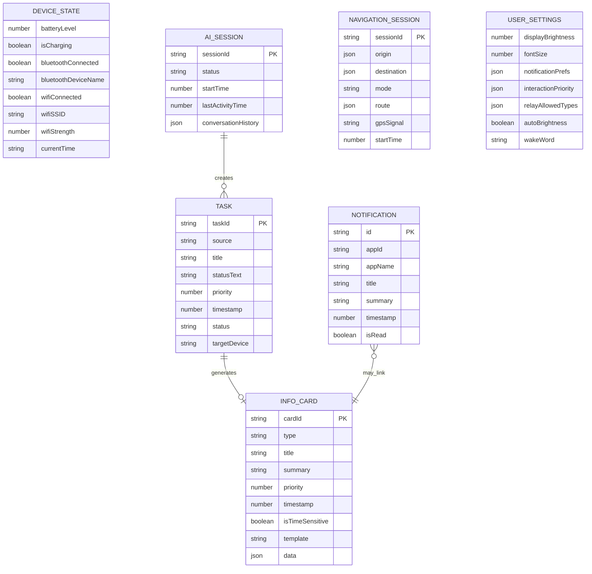
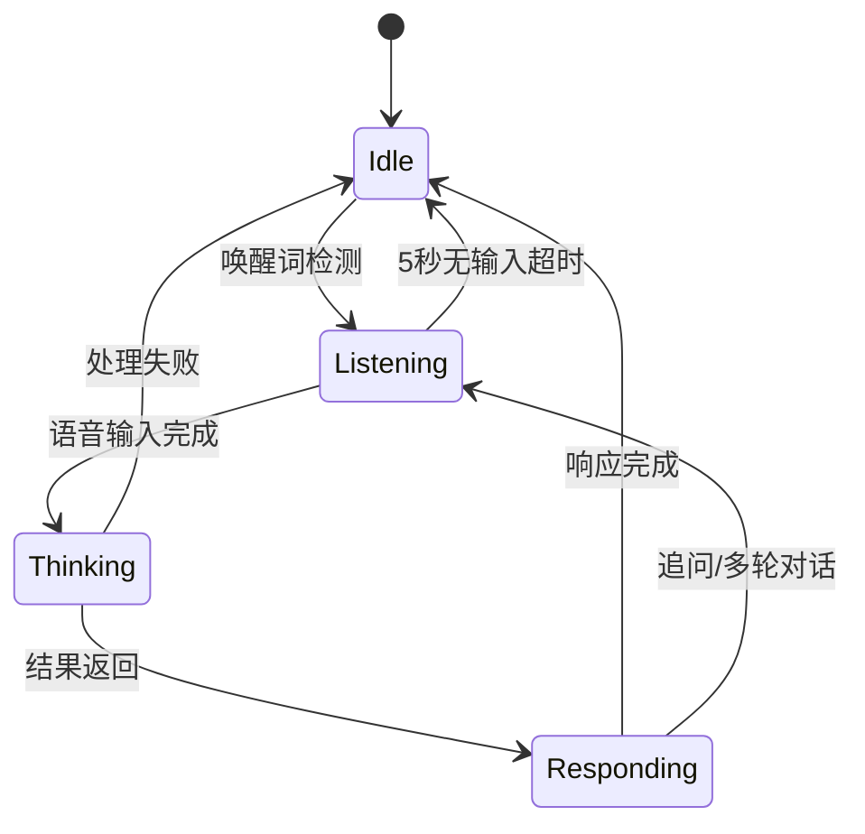
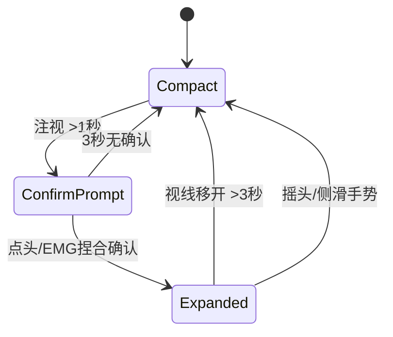

# Q95 Pro 智能眼镜系统交互预研 — 技术设计文档

## 概述

本设计文档为 Q95 Pro 智能眼镜系统交互预研项目提供完整的技术设计方案。Q95 Pro 是一款基于 Android + Vela 魔改操作系统的彩色双目显示智能眼镜，支持六种多模态交互方式。本设计覆盖从硬件显示层到应用层的完整系统架构，包括屏幕布局系统、多模态交互管理、AI 语音助手、跨设备任务中心、AR 导航、手机信息流转等核心模块，并最终输出可交互的可视化 Demo。

### 设计目标

1. 定义清晰的系统分层架构，确保各模块职责明确、松耦合
2. 设计统一的多模态交互管理框架，处理六种输入方式的优先级和冲突
3. 构建以 AI 语音助手为核心的跨设备任务控制体系
4. 输出完整的交互设计规范和可运行的可视化 Demo
5. 评估各模块的技术可行性和实现风险

### 技术选型决策

| 决策项 | 选型 | 理由 |
|--------|------|------|
| 显示方案 | Micro-OLED（主推）/ MicroLED（备选） | Micro-OLED 成熟度高、分辨率达 1920×1080/eye；MicroLED 亮度更优但分辨率受限 |
| 操作系统 | Android + Vela 魔改 | 兼顾 Android 生态和低功耗实时性需求 |
| UI 框架 | 自定义 Compose-based 渲染引擎 | 适配双目显示和 AR 叠加渲染需求 |
| 语音引擎 | 端侧 ASR + 云端 LLM 混合 | 端侧保证低延迟唤醒，云端保证复杂语义理解 |
| 导航引擎 | 高德/百度 AR SDK 集成 | 成熟的 AR 导航能力，支持步行和骑行 |
| 跨设备通信 | BLE 5.0 + Wi-Fi Direct | BLE 低功耗常连，Wi-Fi Direct 大数据传输 |
| Demo 技术栈 | Web (React + Three.js) | 跨平台运行，支持 PC/手机浏览器演示 |

## 架构

### 系统分层架构

```mermaid
graph TB
    subgraph 应用层["应用层 (Application Layer)"]
        AR[AR_Navigation]
        CAM[Camera_Module]
        MUS[Music_Player]
        TRA[Translator]
        TEL[Teleprompter]
        HEA[Health_Monitor]
        MSG[Messaging_Module]
        SET[Settings_Panel]
        APP[App_Store_Bridge]
        TP[Third_Party_Control]
    end

    subgraph 服务层["服务层 (Service Layer)"]
        AI[AI_Assistant]
        TC[Task_Center]
        PR[Phone_Relay]
        NC[Notification_Center]
        IOT[IoT_Control]
        VL[Vehicle_Link]
        WL[Watch_Link]
    end

    subgraph 框架层["框架层 (Framework Layer)"]
        IM[Interaction_Manager]
        LM[Layout_Manager]
        NE[Navigation_Engine]
        SM[State_Manager]
    end

    subgraph 系统层["系统层 (System Layer)"]
        DIS[Display_Driver]
        SEN[Sensor_Hub]
        BT[Bluetooth_Stack]
        WIFI[Wi-Fi_Module]
        GPS[GPS_Module]
        AUD[Audio_Engine]
    end

    应用层 --> 服务层
    服务层 --> 框架层
    框架层 --> 系统层
```



### 屏幕布局架构



### 多模态交互架构



### AI 任务控制架构



## 组件与接口

### 1. Display_Panel（显示面板）

**职责：** 管理双目显示硬件，提供渲染表面和亮度控制。

```typescript
interface DisplayPanel {
  // 获取显示规格
  getSpec(): DisplaySpec;
  // 设置亮度 (0-100)
  setBrightness(level: number): void;
  // 获取环境光传感器数据
  getAmbientLight(): number;
  // 启用/禁用自动亮度
  setAutoBrightness(enabled: boolean): void;
  // 设置刷新率
  setRefreshRate(hz: 60 | 90 | 120): void;
}

interface DisplaySpec {
  resolution: { width: number; height: number }; // per eye
  maxBrightness: number; // nits
  refreshRate: number; // Hz
  fov: number; // degrees
  panelType: 'MicroOLED' | 'MicroLED' | 'LCoS';
}
```

### 2. Layout_Manager（布局管理器）

**职责：** 管理屏幕三分区布局，处理区域间的空间关系和层级。

```typescript
interface LayoutManager {
  // 获取分区边界
  getZoneBounds(zone: ScreenZone): Rect;
  // 设置 Smart_Task_Zone 模式
  setSmartTaskMode(mode: 'compact' | 'expanded'): void;
  // 检查区域是否遮挡
  checkOverlap(zoneA: ScreenZone, zoneB: ScreenZone): boolean;
  // 注册浮层
  registerOverlay(overlay: OverlayConfig): string;
  // 移除浮层
  removeOverlay(id: string): void;
}

type ScreenZone = 'main_task_area' | 'smart_task_zone' | 'status_bar';

interface Rect {
  x: number; y: number; width: number; height: number;
}

interface OverlayConfig {
  zone: ScreenZone;
  opacity: number; // 0-1
  priority: number;
  content: RenderNode;
}
```

### 3. Smart_Task_Zone（智能任务区）

**职责：** 管理 AI 状态球、任务摘要、注视展开/收回逻辑。

```typescript
interface SmartTaskZone {
  // 获取当前模式
  getMode(): 'compact' | 'expanded';
  // 更新 AI 状态
  setAIStatus(status: AIStatus): void;
  // 添加/更新任务
  upsertTask(task: TaskSummary): void;
  // 移除任务
  removeTask(taskId: string): void;
  // 获取所有活跃任务
  getActiveTasks(): TaskSummary[];
  // 处理注视事件
  onGazeEvent(event: GazeEvent): void;
  // 处理确认手势
  onConfirmGesture(type: 'nod' | 'emg_pinch'): void;
  // 处理收回手势
  onDismissGesture(type: 'head_shake' | 'side_swipe' | 'gaze_away'): void;
}

type AIStatus = 'idle' | 'listening' | 'thinking' | 'responding';

interface TaskSummary {
  taskId: string;
  source: string; // 来源模块
  title: string;
  statusText: string; // 如 "导航中 · 还有 500m"
  priority: number;
  timestamp: number;
}

interface GazeEvent {
  target: ScreenZone;
  duration: number; // ms
  isGazing: boolean;
}
```

### 4. Status_Bar（设备状态栏）

**职责：** 显示和管理设备状态信息。

```typescript
interface StatusBar {
  // 获取当前状态
  getStatus(): DeviceStatus;
  // 更新电量
  updateBattery(level: number, isCharging: boolean): void;
  // 更新连接状态
  updateConnection(type: 'bluetooth' | 'wifi', connected: boolean, detail?: string): void;
  // 展开详细信息
  expand(): void;
  // 收起
  collapse(): void;
}

interface DeviceStatus {
  battery: { level: number; isCharging: boolean; isLow: boolean; isCritical: boolean };
  bluetooth: { connected: boolean; deviceName?: string };
  wifi: { connected: boolean; ssid?: string; strength?: number };
  time: string;
}
```

### 5. Interaction_Manager（交互管理器）

**职责：** 统一管理六种交互输入，处理优先级和冲突。

```typescript
interface InteractionManager {
  // 注册输入源
  registerInput(source: InputSource): void;
  // 设置优先级规则
  setPriorityRules(rules: PriorityRule[]): void;
  // 获取当前可用输入方式
  getAvailableInputs(): InputSource[];
  // 处理输入事件
  processInput(event: InputEvent): ProcessedAction;
  // 监听传感器状态变化
  onSensorStatusChange(callback: (source: InputSource, available: boolean) => void): void;
}

type InputSource = 'side_touchpad' | 'voice' | 'emg_band' | 'camera_gesture' | 'head_tracking' | 'physical_button';

interface PriorityRule {
  sources: InputSource[];
  priority: number; // 数值越高优先级越高
  context?: string; // 适用场景
}

interface InputEvent {
  source: InputSource;
  type: string; // 如 'tap', 'swipe', 'pinch', 'nod'
  data: Record<string, unknown>;
  timestamp: number;
}

interface ProcessedAction {
  action: string;
  source: InputSource;
  latency: number; // ms
  conflictResolved: boolean;
}
```

### 6. AI_Assistant（AI 语音助手）

**职责：** 处理语音唤醒、语音识别、自然语言理解和响应生成。

```typescript
interface AIAssistant {
  // 激活助手
  activate(): Promise<void>;
  // 停用助手
  deactivate(): void;
  // 获取当前状态
  getStatus(): AIStatus;
  // 处理语音输入
  processVoice(audioStream: AudioStream): Promise<AssistantResponse>;
  // 处理文本输入
  processText(text: string): Promise<AssistantResponse>;
  // 设置唤醒词
  setWakeWord(word: string): void;
  // 设置超时时间
  setIdleTimeout(ms: number): void;
}

interface AssistantResponse {
  text: string;
  confidence: number; // 0-1
  intent?: Intent;
  actions?: TaskAction[];
  needsConfirmation: boolean;
}

interface Intent {
  name: string;
  target: 'local' | 'phone' | 'iot' | 'vehicle' | 'watch' | 'third_party';
  params: Record<string, unknown>;
}
```

### 7. Task_Center（任务中心）

**职责：** 路由和执行跨设备任务指令。

```typescript
interface TaskCenter {
  // 执行任务
  executeTask(intent: Intent): Promise<TaskResult>;
  // 执行复合任务
  executeCompoundTask(intents: Intent[]): Promise<TaskResult[]>;
  // 获取任务状态
  getTaskStatus(taskId: string): TaskStatus;
  // 取消任务
  cancelTask(taskId: string): Promise<void>;
  // 检查设备可达性
  checkDeviceReachable(target: Intent['target']): Promise<boolean>;
}

interface TaskResult {
  taskId: string;
  success: boolean;
  message: string;
  data?: Record<string, unknown>;
}

type TaskStatus = 'pending' | 'executing' | 'completed' | 'failed' | 'cancelled';
```

### 8. Phone_Relay（手机信息流转）

**职责：** 接收手机流转信息，生成 Info_Card 并管理排序。

```typescript
interface PhoneRelay {
  // 接收流转信息
  receiveInfo(info: RelayInfo): void;
  // 获取所有信息卡片（已排序）
  getInfoCards(): InfoCard[];
  // 展开卡片详情
  expandCard(cardId: string): InfoCardDetail;
  // 设置允许流转的信息类型
  setAllowedTypes(types: RelayInfoType[]): void;
  // 获取连接状态
  getConnectionStatus(): 'connected' | 'disconnected';
}

type RelayInfoType = 'delivery' | 'calendar' | 'call' | 'flight' | 'ride' | 'movie' | 'wechat' | 'music';

interface RelayInfo {
  type: RelayInfoType;
  data: Record<string, unknown>;
  timestamp: number;
  priority: number;
  isTimeSensitive: boolean;
}

interface InfoCard {
  cardId: string;
  type: RelayInfoType;
  title: string;
  summary: string;
  priority: number;
  timestamp: number;
  template: CardTemplate;
}

type CardTemplate = 'delivery_progress' | 'calendar_event' | 'call_info' | 'flight_board' | 'ride_status' | 'movie_ticket' | 'wechat_message' | 'music_player';
```

### 9. Notification_Center（通知中心）

**职责：** 聚合、排序和展示通知消息。

```typescript
interface NotificationCenter {
  // 添加通知
  addNotification(notification: Notification): void;
  // 获取未读通知（时间倒序）
  getUnreadNotifications(): Notification[];
  // 按应用分组获取
  getGroupedNotifications(): Map<string, Notification[]>;
  // 标记已读
  markAsRead(notificationId: string): void;
  // 归档旧通知
  archiveOldNotifications(threshold: number): number;
  // 获取通知总数
  getCount(): { total: number; unread: number };
}

interface Notification {
  id: string;
  appId: string;
  appName: string;
  title: string;
  summary: string;
  timestamp: number;
  isRead: boolean;
  actions?: NotificationAction[];
}

interface NotificationAction {
  label: string;
  actionId: string;
}
```

### 10. AR_Navigation（AR 导航）

```typescript
interface ARNavigation {
  // 规划路线
  planRoute(destination: Location, mode: 'walk' | 'bike'): Promise<Route>;
  // 开始导航
  startNavigation(route: Route): void;
  // 停止导航
  stopNavigation(): void;
  // 获取当前导航状态
  getNavigationState(): NavigationState;
  // 重新规划路线
  reroute(): Promise<Route>;
}

interface NavigationState {
  isActive: boolean;
  currentPosition: Location;
  nextTurn: TurnInstruction;
  remainingDistance: number; // meters
  estimatedArrival: number; // timestamp
  gpsSignal: 'strong' | 'weak' | 'lost';
}

interface TurnInstruction {
  direction: 'left' | 'right' | 'straight' | 'uturn';
  distance: number; // meters to turn
  streetName?: string;
}
```


## 数据模型

### 核心数据实体



### 状态机定义

#### AI_Status_Orb 状态机



#### Smart_Task_Zone 模式状态机



#### 交互输入优先级模型

```
优先级（从高到低）：
1. 物理按键 (Physical Button) — 紧急操作，最高优先
2. 语音输入 (Voice) — 自然交互，高优先
3. EMG 手势 (EMG_Band) — 精确手势，中高优先
4. 侧边触控 (Side_Touchpad) — 常规操作，中优先
5. 摄像头手势 (Camera_Gesture) — 视觉手势，中低优先
6. 头部追踪 (Head_Tracking) — 持续追踪，低优先（作为光标控制）
```

### Info_Card 模板数据结构

```typescript
// 外卖订单卡片
interface DeliveryCard {
  orderId: string;
  storeName: string;
  status: 'preparing' | 'picked_up' | 'delivering' | 'arrived';
  riderName: string;
  estimatedTime: number; // minutes
  progress: number; // 0-100
}

// 机票卡片
interface FlightCard {
  flightNo: string;
  airline: string;
  departure: { city: string; airport: string; time: string; gate?: string };
  arrival: { city: string; airport: string; time: string };
  status: 'on_time' | 'delayed' | 'boarding' | 'departed';
}

// 打车卡片
interface RideCard {
  orderId: string;
  driverName: string;
  carInfo: string; // 如 "白色大众帕萨特 京A12345"
  estimatedArrival: number; // minutes
  driverLocation: Location;
}

// 音乐播放卡片
interface MusicCard {
  trackName: string;
  artist: string;
  albumArt?: string;
  progress: number; // 0-100
  duration: number; // seconds
  isPlaying: boolean;
}
```

### 信息排序算法

Info_Card 排序基于以下权重公式：

```
score = priority_weight × priority + time_sensitivity_weight × isTimeSensitive + recency_weight × (1 / age_minutes)
```

其中：
- `priority_weight = 0.4`
- `time_sensitivity_weight = 0.35`
- `recency_weight = 0.25`
- 时效性信息（如即将出发的机票、正在配送的外卖）获得更高排序分数
